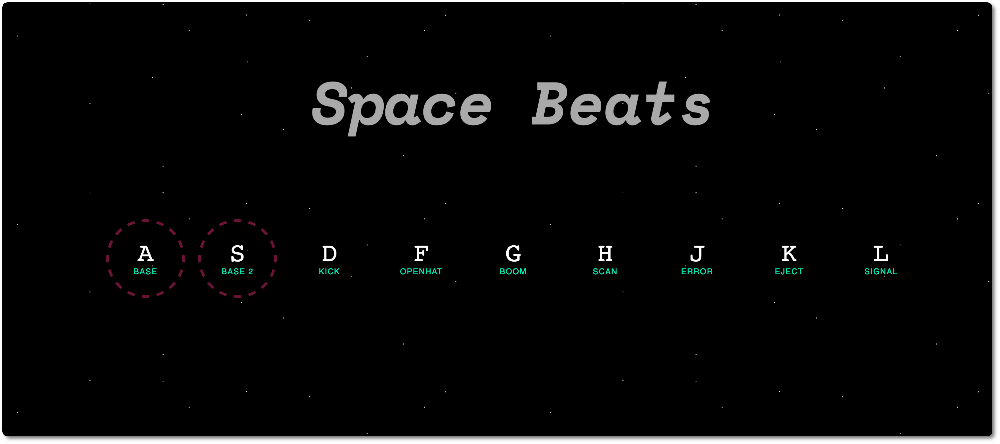
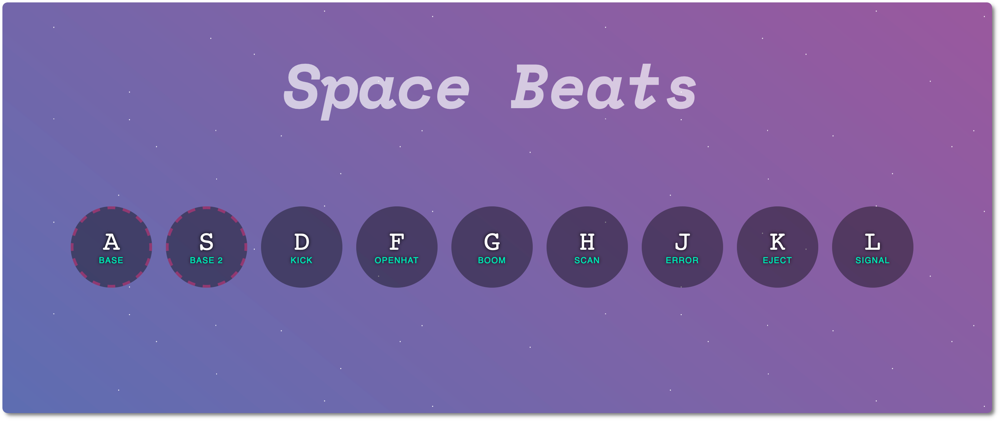

# 01 - Drum Kit 



This project consists of a Drum Kit with multiple keys allowing the user to play different sound effects. I have added two "base" types, which are longer melodies that can be played on the background while experimenting with the rest of the sounds. When the user activates at least one of the base melodies, the background of the space changes, and it gets colourful:



<br >

## This project allowed me to practice...

- `data-*` attributes

* `keyCode` property ([deprecated](https://developer.mozilla.org/en-US/docs/Web/API/KeyboardEvent/keyCode))
* `this` variable
* `transitionend` and `animationend` events
* `play()` method


---

<br >

## Structure

This project was built with HTML, CSS and JavaScript. Instead of using a separate file for JavaScript, it was in the html file. The JavaScript code is structured the following way:

```js
// Constant to get the DOM elements
const elements = {
  body: document.querySelector('body'),
  keys: document.querySelectorAll('.key'),
};

// Function that plays the sound
function playSound(ev) {
  // 1. Play the audio
  // 2. Change the class
  // 3. Apply animation if "base" key is pressed
}

// Function that removes transition (keys)
function removeTransition(ev) {
  //...
}

// Function that removes animations (background)
function removeAnimation() {
  //...
}

// Add Event listeners
	//...
```

<br >

## Process

1. **We listen for keydown event on the window**

```js
window.addEventListener('keydown', playSound);

function playSound(ev) {
  const pressedKey = ev.keyCode;
  const audio = document.querySelector(`audio[data-key="${pressedKey}`);
  const key = document.querySelector(`.key[data-key="${pressedKey}`);

  if (!audio) return; // stop function from running

  // Play audio
  audio.currentTime = 0;
  audio.play();

  // Change class
  key.classList.add('playing');

  // Apply animation if base is played
  if (pressedKey === 65 || pressedKey === 83) {
    elements.body.classList.remove('animate');

    void elements.body.offsetWidth; // allows to re-start animation
    elements.body.classList.add('animate');
  }
}
```

- We want to find out if there is an audio element on the page that has a `data-key` of `ev.keyCode` which is the code of the key that we pressed.

- `if(!audio) return` 👉🏻 stops the function from running altogether
- We can play the audio element with `audio.play()` 
  - ⚠️ if you play on an audio that is already playing, it won't play 👉🏻 we want to rewind it to the start and so we must use: `audio.currentTime = 0`;
- We apply the class `playing` to the key element on the screen that was pressed.
- If any of the `base` type keys was pressed (keyCode 65 and 83) then remove the class `animate` (in case it was applied before) and apply it again after 
  - `void elements.body.offsetWidth` allows us to re-start the animation (more on this [here](https://css-tricks.com/restart-css-animation/))

<br >

2. **Taking care of the classes change**

```js
function removeTransition(ev) {
  if (ev.propertyName !== 'transform') return; // skip funciton if it's not 'transform'
  this.classList.remove('playing');
}

// Event listeners
window.addEventListener('keydown', playSound);
const keys = elements.keys;
keys.forEach((key) =>
	key.addEventListener('transitionend', removeTransition)
	);
```

- We select the `key` element that we see on the screen (different from the `audio` element) 
- We listen for the `transitionend` event on the `key` elements, that fires when it has stopped the transition itself
  - Listen on in each key for when the transition end happens
  - We normally take the longest one -> `transform`
  - We use `this` which in this case is the element that the event was run in

----
<br>


ℹ️ This project was based on one of Wes Bos' [JavaScript 30](https://javascript30.com/) challenges.
