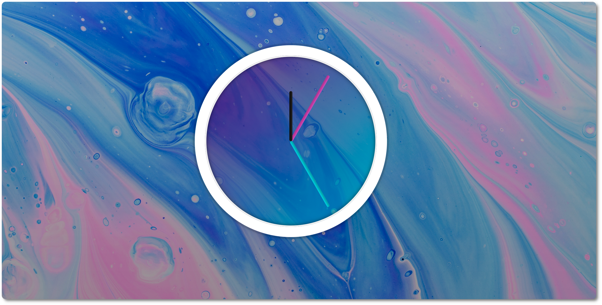

# 02 - CSS & JS Clock



The purpose of this project was to build a simple clock with CSS and plain JavaScript. 


## Learning


- Getting the current date with the `Date()` method: extracting hours, minutes and seconds
- Using the `transform` property to get the clock hands to move
- Using `transition-timing-function` and `cubic-bezier` to make the movement fo the hands of the clock resemble a real clock.


<br>


## Structure and goal

The clock has three `div` that represent each hand of the clock:

- `<div class="hand hour-hand">`
- `<div class="hand min-hand">`
- `<div class="hand second-hand">`


🎯 We want to rotate each `div` depending on what time it currently is.


<br /> 

## Process

1. We want the hands to rotate on the end and not from the middle -> we transform the origin (from where it is going to apply all transformations, including rotate)

```css
.hand {
  width: 50%;
  height: 6px;
  background: black;
  position: absolute; 
  top: 50%;
  transform-origin: 100%; 👈🏻
  transform: rotate(90deg); /* so all hands start at 12:00 */
}
```

- By default, `transform-origin` is 50%. 10% along the X axis, puts it on the right side.

<br /> 

2. Adding a transition so that the change is more "clock-like". We use `transition-timing-function` to make the movement more real

```css
.hand {
  ...
  transition: all 0.05s;
  transition-timing-function: cubic-bezier(0.1, 2.7, 0.58, 1);
}
```

<br /> 

3. We create a function that gets all elements to make things cleaner

```js
const elements = {
  secondHand: document.querySelector('.second-hand'),
  minuteHand: document.querySelector('.min-hand'),
  hourHand: document.querySelector('.hour-hand'),
};
```
<br /> 

4. We create the function that sets the date. We will run this function every second with `setInterval`

```js
function setDate() {
  const now = new Date();

  const seconds = now.getSeconds();
  const minutes = now.getMinutes();
  const hour = now.getHours();

  // seconds
  const secondsDegrees = (seconds / 60) * 360 + 90; // because we set original deg to 90deg
  elements.secondHand.style.transform = `rotate(${secondsDegrees}deg)`;

  // same for mins and hours....
}

setInterval(setDate, 1000);
```


---

<br>


ℹ️ This project was based on one of Wes Bos' [JavaScript 30](https://javascript30.com/) challenges.
