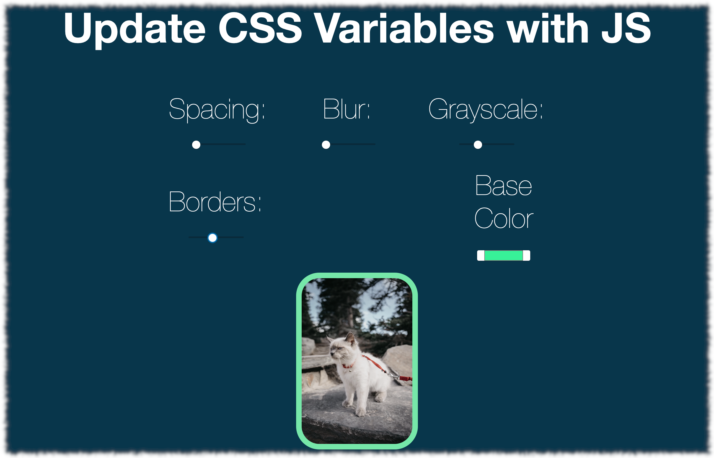

# 03 - CSS Variables



The purpose of this project is to create CSS variables and manipulate them with JavaScript

<br />

## Learning notes

- CSS variables can be updated via javascript 👉🏻 while SASS variables are created at compile time and can't be changed via javascript.
- Selecting a variable: selecting the entire document and set a property with the name of our variables.


<br/>

### Structure and goal

🎯 Manipulating CSS variables via JavaScript

1. Creating the css variables
2. 

<br />


### Process

<br />

These are the variables:

```css
:root {
  --base: #ffc600;
  --spacing: 10px;
  --blur: 10px;
}

img {
  padding: var(--spacing);
  background: var(--base);
  filter: blur(var(--blur));
}

.h1 {
  color: var(--base);
}
```

<br />

**script.js**

We create a `nodeList` with all the inputs and a function that will take care of updating the values of the variables:

```js
const inputs = document.querySelectorAll('.controls input');

function handleUpdate() {
  //...
}

inputs.forEach(input => input.addEventListener('change', handleUpdate))
inputs.forEach(input => input.addEventListener('mousemove', handleUpdate))


```

- We listen to a change event on each of the inputs
- We add the mouse move because we want the value to update as we move the circle of each input


<br />

Reuse a `data-*` attribute to be able to add a suffix with the size type for each input. For example, both spacing and blu will have `px` attached to their value:

```js
function handleUpdate() {
  const suffix = this.dataset.sizing || '';
  
}
```

👉🏻 because the names of the variables equal the names of the inputs we can make it simple:

```js
function handleUpdate() {
  const suffix = this.dataset.sizing || '';
  document.documentElement.style.setProperty(`--${this.name}`, this.value + suffix);
  
}
```

👉🏻 **`Document.documentElement`** returns the `Element` that is the root element of the `document` (for example, the `<html>` element for HTML documents). [ref](https://developer.mozilla.org/en-US/docs/Web/API/Document/documentElement)

👉🏻 The **`CSSStyleDeclaration.setProperty()`** method interface sets a new value for a property on a CSS style declaration object. [ref]()https://developer.mozilla.org/en-US/docs/Web/API/CSSStyleDeclaration/setProperty


<br />

----

ℹ️ This project was based on one of Wes Bos' [JavaScript 30](https://javascript30.com/) challenges.